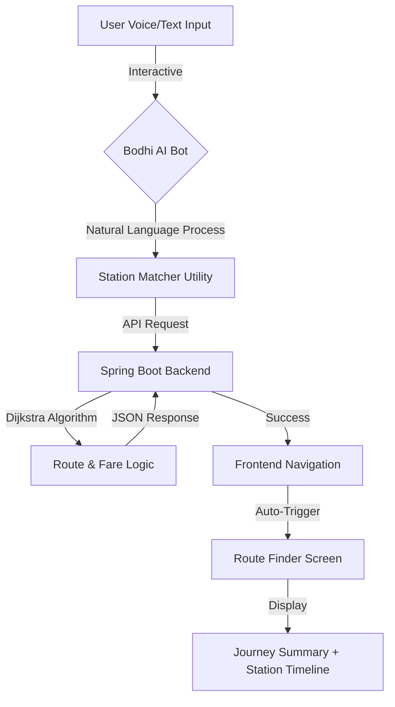

# 🚇 Patna Metro App

[](https://reactnative.dev/)
[](https://expo.dev/)
[](https://spring.io/projects/spring-boot)
[](https://nativewind.dev/)

**Patna Metro** is a modern, high-performance mobile application designed to simplify commuting in Bihar's capital. Featuring an AI-powered voice assistant named **Bodhi**, real-time route finding, and a seamless bilingual experience, it brings the future of transit to your fingertips.

---

## ✨ Features

- **🤖 Bodhi AI Assistant**: An advanced voice-enabled assistant that understands Natural Language (Hindi/English) to find routes.
- **🗺️ Interactive Route Finder**: Smart station matching with auto-triggering search capabilities.
- **📄 Live Metro Map**: A high-resolution, pinch-to-zoom interactive network map.
- **💸 Fare & Time Estimation**: Real-time calculations for ticket prices and journey durations.
- **🌐 Bilingual Support**: Fully translated interface in **Hindi** and **English**.
- **📱 Premium UI/UX**: Built with NativeWind for a sleek, glassmorphic design with smooth animations.

---

## 🛠️ Tech Stack

### **Frontend**
- **Framework**: React Native with **Expo SDK 54**
- **Navigation**: Expo Router (File-based routing)
- **Styling**: NativeWind (Tailwind CSS for Native)
- **Animations**: React Native Reanimated
- **Voice Recognition**: Expo Speech Recognition (Android 11+ ready)
- **Data Fetching**: React Query (TanStack Query) & Axios

### **Backend**
- **Framework**: Spring Boot (Java)
- **Database**: PostgreSQL / MongoDB (configured for fast route lookup)
- **Deployment**: Render (HTTPS secured)

---

## 🏗️ Architecture & Workflow

The app follows a modern client-server architecture. Below is the workflow for a typical user journey (Route Finding):



---

## 🚀 Getting Started

### **Prerequisites**
- [Node.js](https://nodejs.org/) (v18 or newer)
- [Watchman](https://facebook.github.io/watchman/) (for macOS/Linux)
- [Expo Go](https://expo.dev/expo-go) app on your physical device.

### **Installation**

1. **Fork & Clone**
   ```bash
   git clone https://github.com/YOUR_USERNAME/Patna-Metro-App.git
   cd Patna-Metro-App
   ```

2. **Install Dependencies**
   ```bash
   npm install --legacy-peer-deps
   ```

3. **Configure Environment**
   Update `src/services/api.js` with your backend URL:
   ```javascript
   const API_BASE_URL = "https://your-backend-url.com/api";
   ```

4. **Run Locally**
   ```bash
   npx expo start
   ```
   Scan the QR code with your **Expo Go** app.

---

## 📦 Building for Production

This project uses **EAS (Expo Application Services)** for automated builds.

### **Generate APK (Testing)**
```bash
npx eas build --profile preview --platform android
```

### **Generate AAB (Play Store)**
```bash
npx eas build --profile production --platform android
```

---

## 📂 Project Structure

```text
├── app/                  # Expo Router directory (Screens)
├── assets/               # Images, Fonts, and Videos
├── src/
│   ├── components/       # Reusable UI components
│   │   ├── bot/          # Bodhi Assistant logic & UI
│   │   ├── RouteFinder/  # Core route search engine
│   │   └── ui/           # Navbar, Footer, etc.
│   ├── services/         # API (Axios) configurations
│   ├── utils/            # i18n, Station Matcher, Helpers
│   └── context/          # State Management
├── global.css            # Tailwind global styles
└── app.json              # Expo configuration
```

---

## 🤝 Contributing

1. Fork the Project
2. Create your Feature Branch (`git checkout -b feature/AmazingFeature`)
3. Commit your Changes (`git commit -m 'Add some AmazingFeature'`)
4. Push to the Branch (`git push origin feature/AmazingFeature`)
5. Open a Pull Request

---

## 👤 Developer

**Rachit Sharma**
- GitHub: [@rachitsharma300](https://github.com/rachitsharma300)
- LinkedIn: [In/RachitSharma300](https://linkedin.com/in/rachitsharma300)

---
*Made with ❤️ in Bihar*
